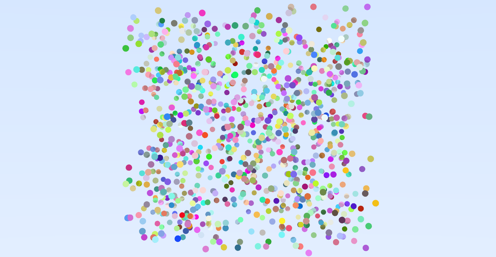
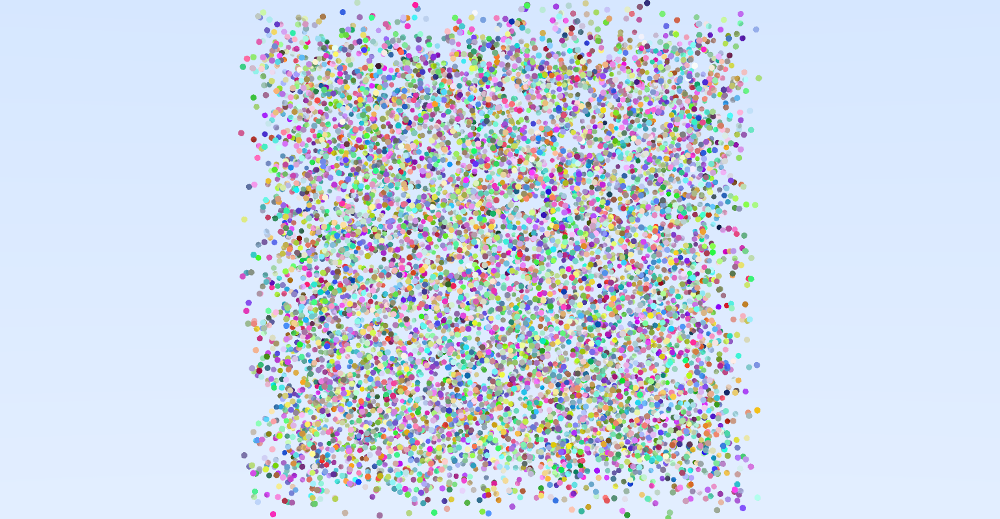
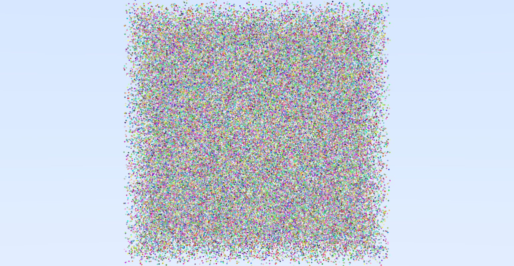
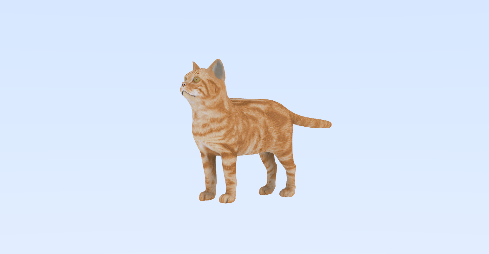

# Regular Grid 🗂️
___

Fondamenti di Grafica Tridimensionale, a.a. 2021 - 2022

_Davide Coviello - 62865_

_Simone Smaldore - 62728_

_Dario Satriani  - 61196_

---

# Riferimenti modelli
I modelli per far funzionare il progetto possono essere scaricati al seguente link:
https://drive.google.com/drive/folders/1zRK226c36zDrGCiMxPPCbSRMtkT7TkK_?usp=sharing

# Benchmark

Per condurre il benchmark test della Regular Grid, è stata utilizzata una finestra con dimensione 800x400 e, per ogni pixel sono stati utilizzati 8 raggi (ns = 8).

Di seguito verrà adottata la seguente convenzione:

 - ti: tempo di inizializzazione della griglia;
 - tr: tempo di rendering;
 - ttot: tempo totale (ti + tr).

## Scelta del moltiplicatore
Nella costruzione della griglia è necessario impostare un valore m, chiamato moltiplicatore, legato alla quantità di celle che verranno calcolate.

Di seguito si riportano i test effettuati per determinare il migliore valore di m, facendo riferimento a scene composte da sole sfere.

### 1000 sfere
m | n. celle | ti | tr | ttot
--| -- | -- | -- | --
1 | 1210 | 0.004s | 1.486s | 1.49s
2 | 8820 | 0.008s | 1.201s | 1.209
3 | 28830 | 0.017s | 1.225s | 1.242s
4 | 67240 | 0.036s | 1.363s | 1.399s

### 10000 sfere
m | n. celle | ti | tr | ttot
--| -- | -- | -- | --
1 | 10648| 0.016s | 2.962s | 2.978s
2 | 85184 | 0.047s | 2.008s | 2.055s
3 | 274625 | 0.048s | 2.224s| 2.272s
4 | 658503 | 0.103s | 2.539s | 2.642s

### 100000 sfere
m | n. celle | ti | tr | ttot
--| -- | -- | -- | --
1 | 103823 | 0.118s | 5.515s| 5.633s
2 | 804357 | 0.262s | 3.967s | 4.229s
3 | 2744000 | 0.655s | 4.465s | 5.12s
4 | 6434856 | 1.067s | 5.32s | 6.387s

Come evidenziato dai dati riportati, aumentando il valore del moltiplicatore, aumenta il numero di celle e di conseguenza anche il tempo per la costruzione della griglia; contrariamente, in generale, aumentare il numero di celle riduce il tempo di rendering, come prevedibile.
Il compromesso ottimale è stato osservato per m = 2. 

## Risultati a confronto

### 100 Sfere
Griglia | ti | tr |  ttot
-- | -- | -- | --
NO | | 2.8s | 2.8s
SI | 0.004s | 0.72s | 0.724s

### 1000 Sfere
Griglia | ti | tr |  ttot
-- | -- | -- | --
NO | | 29.4s | 29.4s
SI | 0.004s | 1.15s | 1.154s

### 10000 Sfere
Griglia | ti | tr |  ttot
-- | -- | -- | --
NO | | ~330.88s | ~330.88s
SI | 0.03s | 2.04s | 2.07s

### 100000 Sfere
Griglia | ti | tr |  ttot
-- | -- | -- | --
NO | | ~6105s | ~6105s
SI | 0.28s | 4.08s | 4.36s

### 1000000 Sfere
Griglia | ti | tr |  ttot
-- | -- | -- | --
NO | | :skull: | :skull:
SI | 2.65s | 9s | 11.65s

# Risultati ottenuti con le Mesh

## Gatto con 70.500 triangoli

Griglia | ti | tr |  ttot
-- | -- | -- | --
NO | | ~7min | ~7min
SI | 0.16s | 2.87s | 3.03s

## Persona con 100.000 triangoli

Griglia | ti | tr |  ttot
-- | -- | -- | --
NO | | ~8min | ~8min
SI | 0.28s | 2.26s | 2.54s

## Persone con 200.000 triangoli

Griglia | ti | tr |  ttot
-- | -- | -- | --
NO | | ~19min | ~19min
SI | 0.52s | 2.73s | 3.25s

